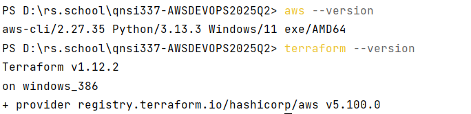

### GitHub Actions Workflow

- Terraform format check
- Terraform initialization
- Terraform plan
- Terraform apply

### How to Use

1. Clone the repo
2. Run `terraform init`
3. Run `terraform plan`
4. Run `terraform apply`
5. Push to GitHub to trigger CI/CD

### Screenshots

- `aws --version`
- `terraform version`